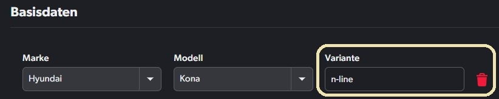

- [Purpose of this project](#purpose-of-this-project)
- [Setup](#setup)
- [How to load extension in your browser?](#how-to-load-extension-in-your-browser)

## Purpose of this project

The purpose of this project is to have free text querying on www.mobile.bg so users can narrow down the search beyond the already existing filters. This tries to emulate the free text querying functionality found on www.mobile.de.



## Setup

```bash
npm i
npm run build
```

The code is bundled using webpack

```json
"build": "webpack --config webpack/webpack.config.js"
```

## How to load extension in your browser?
1. Go to Chrome's extension dashboard in the browser

2. In the top right corner, enable developer mode

3. In the top left corner, click 'Load unpacked'

4. Select the dist directory in the project (NOTE: you must build with previously mentioned command first)